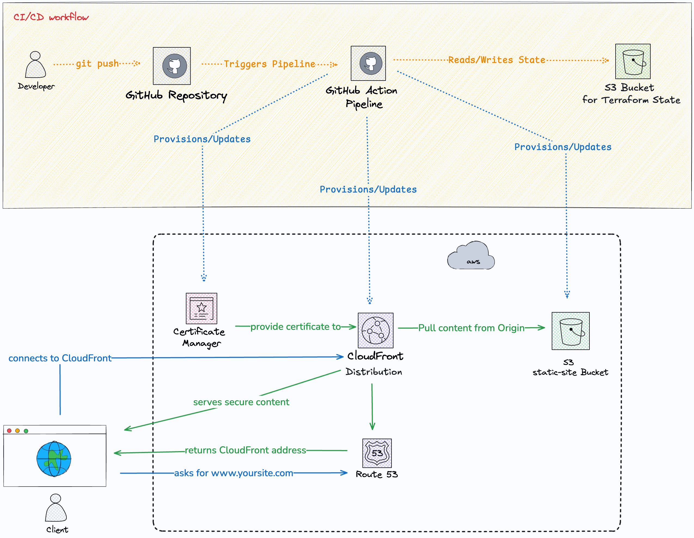

# ☁️ AWS Static Website Hosting with Terraform


## 📖 Project Overview
This project demonstrates how to provision a **High-Performance, Secure, and Scalable** static website hosting infrastructure on AWS using **Terraform (IaC)**.

Instead of manually configuring resources via the AWS Console, this repository defines the entire infrastructure as code, ensuring consistency, version control, and rapid deployment. It also includes an automated CI/CD pipeline using **GitHub Actions**.

## 🏗️ Architecture
The infrastructure is designed for low latency and high availability.



### Key Components:
* **Amazon S3:** Stores the static website files (HTML, CSS, JS) securely.
* **Amazon CloudFront (CDN):** Caches content globally to reduce latency and improve load speeds for users worldwide.
* **AWS Certificate Manager (ACM):** Provisions a free public SSL/TLS certificate to ensure secure HTTPS connections.
* **Amazon Route53:** Manages DNS records to route traffic to the CloudFront distribution.
* **GitHub Actions:** Automates the deployment process (Terraform Apply) upon code changes.

## 🛠️ Tech Stack
* **Infrastructure as Code:** Terraform (HCL)
* **Cloud Provider:** AWS
* **CI/CD:** GitHub Actions (`terraform.yml`)
* **Version Control:** Git

## 📂 Project Structure
```bash
├── aws_acm_certificate.tf        # SSL/TLS Certificate configuration
├── aws_cloudfront_distribution.tf # CDN configuration & Caching policies
├── aws_s3_bucket.tf              # S3 Bucket configuration & Policies
├── provider.tf                   # AWS Provider setup
├── variables.tf                  # Input variables for reusability
├── outputs.tf                    # Output values (e.g., CloudFront URL)
├── terraform.tf                  # Backend & Version constraints
├── terraform.yml                 # GitHub Actions Workflow
└── cloud-diagram.png             # Architecture design


## 🚀 How to Deploy

### Prerequisites

- AWS Account and CLI configured
- Terraform installed
- A registered Domain Name (for Route53)

### Steps

1. **Clone the repository:**

```bash
git clone https://github.com/Jira-saki/aws-static-website-cloudfront-terraform.git
cd aws-static-website-cloudfront-terraform
```

2. **Initialize Terraform:**

```bash
terraform init
```

3. **Review the Plan:**

```bash
terraform plan
```

4. **Apply to AWS:**

```bash
terraform apply --auto-approve
```

## 🔐 Security Features

- **HTTPS Enforced:** All traffic is served over HTTPS using ACM certificates.
- **S3 Security:** Direct access to the S3 bucket is blocked; content is only accessible via CloudFront (OAC/OAI).
- **IaC Best Practices:** State locking and versioning are handled via Terraform.

## 🚧 Future Improvements

- Implement AWS WAF (Web Application Firewall) for added security.
- Add Lambda@Edge for dynamic content manipulation.

---

**Author:** Jirasak Pakdeeto  
Infrastructure Engineer aiming for Cloud & DevOps roles.
